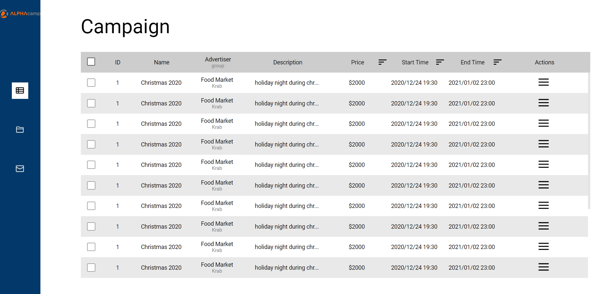
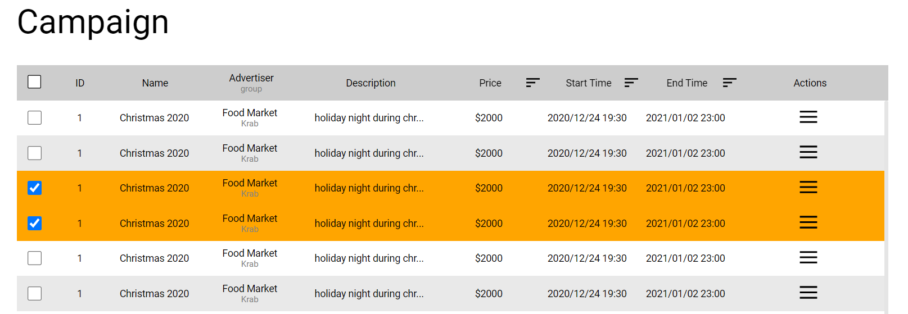
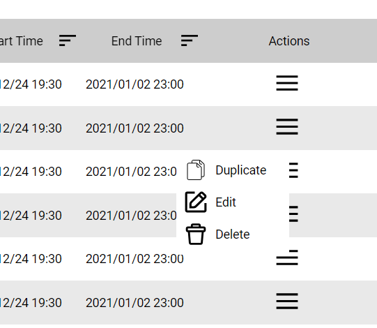

# 廣告排期系統

練習使用 SASS 寫出有較佳層級結構的 CSS

## NAV 導覽列

使用 Javascripts 在點擊後產生底色及變換文字顏色

## 廣告排期內容

### 固定表格標頭

當資料數列增加時，可使用卷軸往下瀏覽

### 勾選 checkbox 能產生明顯辨識顏色

可藉由將表格開頭的 checkbox 打勾，讓整列資料數據變色

### 點擊 Action 欄跳出 popup 功能視窗

